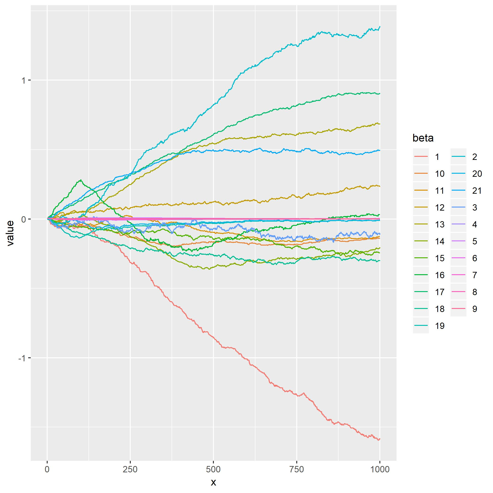
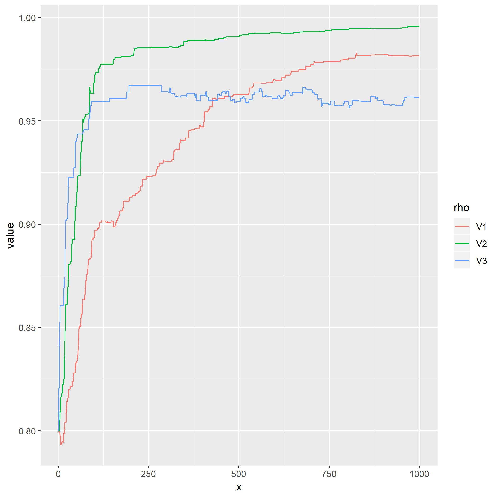
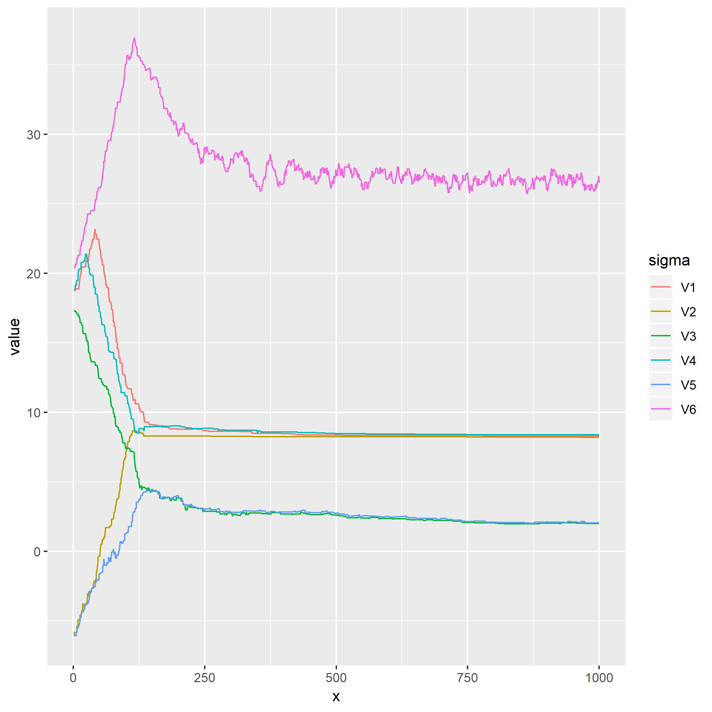

```{r setup, include=FALSE}
knitr::opts_chunk$set(echo = FALSE)
```

```{r, message=FALSE, warning=FALSE}
library(tidyverse)
library(lubridate)
library(truncnorm)
library(mvtnorm)
library(matrixcalc)
library(glmnet)
```

## Problem 1

### Question 1

First, we need to tidy data. As the day of year $x_{i,1}(t)$ and time $t$ are two variables in given model, we need to transform `time` into some suitable formats. Normally, records are taken every 6 hour at 00:00:00, 06:00:00, 12:00:00 and 18:00:00. However, some records are taken at other timepoints. These records are ineffective as there are no record 6 hour before or after those timepoints to help train or test given models. Thus, we remove those observations. For categorical variable `nature`, as the model only use one coefficient for this variable, I assume the relationship among type of hurricans and responses is roughly monotone and changes it to numercial. As I tidied train data and test data in same way, the results will not be quiet influenced by tidy process. There are 10330 observations and 13 variables after tidied data.

```{r}
# Problem 1
shift <- function(x, n=1){
  c(x[-(seq(n))], rep(NA, n))
}
```

```{r}
data1 = read.csv("./hurrican356.csv") %>% 
  janitor::clean_names() %>% 
  mutate(year = season,
         date_hour = time) %>% 
  separate(date_hour, into = c("date", "hour"), sep = " ") %>% 
  filter(hour == "00:00:00)" | hour == "06:00:00)" | hour == "12:00:00)" | hour == "18:00:00)") %>% 
  mutate(hour = str_replace(hour, ":00:00\\)", ""),
         hour = as.numeric(hour),
         date = str_replace(date, "\\(", ""),
         date = yday(date),
         nature = as.numeric(as.factor(nature))) %>% 
  group_by(id) %>% 
  mutate(delta1 = c(NA, diff(latitude)),
         delta2 = c(NA, diff(longitude)),
         delta3 = c(NA, diff(wind_kt)),
         latitude_p = shift(latitude),
         longitude_p = shift(longitude),
         windkt_p = shift(wind_kt)) %>% 
  ungroup() %>% 
  na.omit() %>% 
  select(id, latitude, longitude, wind_kt, latitude_p, longitude_p, windkt_p, date, year, nature, delta1, delta2, delta3)

#head(data1)
#summary(data1)
```

Then, we randomely select 80% hurricanes and remove `id`. There are 7981 observations in the training dataset.

```{r}
set.seed(123)
id = unique(data1$id)
num_id = length(id)
train_id = sample(id, 0.8*num_id)

train_data = data1[which(data1$id %in% train_id),] %>% 
  select(-id)
```

After that, we use componentwise M-H algorithm to develop an MCMC process. As there are too much parameters in this model, they will influence each other and it is hard to find suitable 'step length' a when using regular M-H algorithm.

As $$Y_{i,j}(t+6) = \mu_{i,j}(t) + \rho_jY_{i,j}(t) + \epsilon_{i,j}(t)$$

$$Y_i \sim MVN \bigg( \left[
 \begin{matrix}
   \mu_{i,1}(t)+\rho Y_{i,1}(t) \\
   \mu_{i,2}(t)+\rho Y_{i,2}(t) \\
   \mu_{i,3}(t)+\rho Y_{i,3}(t) \\
  \end{matrix}
  \right], \Sigma \bigg)$$ 

$$f_{Y_i(t+6)}(Y_i|\rho_j, \beta, \Sigma) = \frac{exp[-\frac{1}{2}(Y_i-\mu)^T\Sigma^{-1}(Y_i-\mu)]}{\sqrt{(2\pi)^k|\Sigma|}}$$

$$\pi(\theta) = \prod\frac{exp[-\frac{1}{2}(Y_i-\mu)^T\Sigma^{-1}(Y_i-\mu)]}{\sqrt{(2\pi)^k|\Sigma|}}\times\pi_1(\beta)\pi_2(\rho_1)\pi_3(\rho_2)\pi_4(\rho_3)\pi_5(\Sigma^{-1})$$

Let $\theta = (\beta,\rho_j,\Sigma)$, with probability

$$\alpha(\lambda|\theta^{(t)}) = min \left\{ 1,\frac{\pi(\lambda)q(\theta^{(t)}|\lambda)}{\pi(\theta^{(t)})q(\lambda|\theta^{(t)})}\right\} = min \left\{ 1,\frac{\pi(\lambda)}{\pi(\theta^{(t)})}\right\}$$ when using random walks.

Accept $\theta^{(t+1)} = \lambda$, else, set$\theta^{(t+1)} = \theta^{(t)}$.

```{r}
# Starting points
set.seed(111)
# rho: 1*3 vector
#rho = rtruncnorm(3, a=0, b=1, mean = 0.5, sd = 1/5)
rho = rep(0.8, 3)
# epsilon: 1*3 vector
sigma = bayesm::rwishart(3,diag(0.1,3))$IW
sigma = c(sigma[1,], sigma[2,c(2,3)], sigma[3,3])
#beta: 1*18 vector, where beta_kj is the [6*(j-1)+(k+1)]th number.
#beta = rmvnorm(1, rep(0,21), diag(1,21))
beta = rep(0.005,21)
```

```{r}
# Density function.
# for each yi
logdy = function(obs, beta, rho, sigma){
  x = c(1,obs[7:12])
  y = obs[1:3]
  mu = beta %*% x + rho*obs[1:3]
  dy = dmvnorm(obs[4:6], mean = mu, sigma = sigma)
  return(log(dy))
}

#traintest = train_data[c(1:100),]
#betatest = rep(0.008,21)
#apply(traintest, 1, logdy, beta.=betatest)

logdensity = function(data=train_data, beta.=beta, rho.=rho, sigma.=sigma){
  beta_m = matrix(beta.,3)
  sigma_m = matrix(c(sigma.[c(1:3)], sigma.[2], sigma.[c(4,5)], sigma.[c(3,5)], sigma.[6]), 3)
  logdy = apply(data, 1, logdy, beta=beta_m, rho=rho., sigma=sigma_m)
  logdens = sum(logdy) + log(dmvnorm(beta., rep(0,21), diag(1,21))) + log(dtruncnorm(rho.[1], a=0, b=1, mean = 0.5, sd = 0.2)) + log(dtruncnorm(rho.[2], a=0, b=1, mean = 0.5, sd = 0.2)) + log(dtruncnorm(rho.[3], a=0, b=1, mean = 0.5, sd = 0.2)) + log(MCMCpack::diwish(sigma_m, 3, diag(0.1,3))) 
  return(logdens)
}

#logdensity(train_data)
```

```{r}
# Sampling process
regularMHstep = function(startpars, niter = 1000, rhoa, betaa, sigmaa){
  beta_m = matrix(NA, niter, 21)
  rho_m = matrix(NA, niter, 3)
  sigma_m = matrix(NA, niter, 6)
  beta_m[1,] = startpars$beta
  rho_m[1,] = startpars$rho
  sigma_m[1,] = startpars$sigma
  for (i in 2:niter) {   # correlated issue
    #posbeta = beta_m[i-1,] + runif(21,-1,1)*beta_a*ifelse((runif(21) < 0.1),1,0)
    #posrho = rho_m[i-1,] + runif(3,-1,1)*rho_a*ifelse((runif(3) < 0.1),1,0)
    #possigma = sigma_m[i-1,] + runif(6,-1,1)*sigma_a*ifelse((runif(6) < 0.1),1,0)
    posbeta = beta_m[i-1,] + runif(21,-1,1)*beta_a
    posrho = rho_m[i-1,] + runif(3,-1,1)*rho_a
    possigma = sigma_m[i-1,] + runif(6,-1,1)*sigma_a
    possigma_m = matrix(c(possigma[c(1:3)], possigma[2], possigma[c(4,5)], possigma[c(3,5)], possigma[6]), 3)
    if (sum(ifelse(posrho<1, 0, 1))==0 & is.positive.definite(possigma_m)) {
      if (log(runif(1)) < logdensity(beta.=posbeta, rho.=posrho, sigma.=possigma) - logdensity(beta.=beta_m[i-1,], rho.=rho_m[i-1,], sigma.=sigma_m[i-1,])){
        beta_m[i,] = posbeta
        rho_m[i,] = posrho
        sigma_m[i,] = possigma
        }
      else{
        beta_m[i,] = beta_m[i-1,]
        rho_m[i,] = rho_m[i-1,]
        sigma_m[i,] = sigma_m[i-1,]
      }}
    else{
      beta_m[i,] = beta_m[i-1,]
      rho_m[i,] = rho_m[i-1,]
      sigma_m[i,] = sigma_m[i-1,]
      }
  }
  return(list(MHbeta = beta_m, MHrho = rho_m, MHsigma = sigma_m))
}
```

```{r}
compMHstep = function(startpars, niter = 1000, rhoa, betaa, sigmaa){
  beta_m = matrix(NA, niter, 21)
  rho_m = matrix(NA, niter, 3)
  sigma_m = matrix(NA, niter, 6)
  beta_m[1,] = startpars$beta
  rho_m[1,] = startpars$rho
  sigma_m[1,] = startpars$sigma
  for (i in 2:niter) {  
    posbeta = beta_m[i-1,]
    for (j in 1:21) {
      curbeta = posbeta
      posbeta[j] = posbeta[j] + runif(1,-1,1)*beta_a[j]
      if (log(runif(1)) >= logdensity(beta.=posbeta, rho.=rho_m[i-1,], sigma.=sigma_m[i-1,]) - logdensity(beta.=curbeta, rho.=rho_m[i-1,], sigma.=sigma_m[i-1,])){
        posbeta[j] = curbeta[j]
      }
      }
    beta_m[i,] = posbeta
    posrho = rho_m[i-1,]
    for (j in 1:3) {
      currho = posrho
      posrho[j] = posrho[j] + runif(1,-1,1)*rho_a[j]
      if (sum(ifelse(posrho<1, 0, 1))==0) {
        if (log(runif(1)) >= logdensity(beta.=beta_m[i,], rho.=posrho, sigma.=sigma_m[i-1,]) - logdensity(beta.=beta_m[i,], rho.=currho, sigma.=sigma_m[i-1,])){
          posrho[j] = rho_m[i-1,j]
        }
      }
      else{
        posrho[j] = rho_m[i-1,j]
      }
      }
    rho_m[i,] = posrho
    possigma = sigma_m[i-1,]
    for (j in 1:6) {
      cursigma = possigma
      possigma[j] = possigma[j] + runif(1,-1,1)*sigma_a[j]
      possigma_m = matrix(c(possigma[c(1:3)], possigma[2], possigma[c(4,5)], possigma[c(3,5)], possigma[6]), 3)
      if (is.positive.definite(possigma_m)) {
        if (log(runif(1)) >= logdensity(beta.=beta_m[i,], rho.=rho_m[i,], sigma.=possigma) - logdensity(beta.=beta_m[i,], rho.=rho_m[i,], sigma.=cursigma)){
          possigma[j] = sigma_m[i-1,j]
        }
      }
      else{
        possigma[j] = sigma_m[i-1,j]
      }
    }
    sigma_m[i,] = possigma
  }
  return(list(MHbeta = beta_m, MHrho = rho_m, MHsigma = sigma_m))
}
```

```{r}
# starting points of parameters
startpars = list(rho = rho, beta = beta, sigma = sigma)
rho_a = c(0.005,0.005,0.01)
sigma_a = rep(0.5, 6)
beta_a = c(rep(0.01, 3), rep(0.0005, 2), 0.001, rep(0.0001, 3), rep(0.005,6), 0.01, rep(0.005, 5))
```

```{r, eval=FALSE}
set.seed(123)
MHresults = compMHstep(startpars, niter = 1000, rhoa = rho_a, betaa = beta_a, sigmaa = sigma_a)
```

```{r, eval=FALSE}
# check accept rate
uni_beta = rep(NA,21)
for (i in 1:21){
  uni_beta[i] = length(unique(MHresults$MHbeta[,i]))
}
uni_beta

uni_sigma = rep(NA,6) 
for (i in 1:6) {
  uni_sigma[i] = length(unique(MHresults$MHsigma[,i]))
}
uni_sigma

uni_rho = rep(NA,3)
for (i in 1:3) {
  uni_rho[i] = length(unique(MHresults$MHrho[,i]))
}
uni_rho
```

```{r, eval=FALSE}
# print chain plots
niter = 1000
beta_results = as.data.frame(MHresults$MHbeta) %>% 
  mutate(x = 1:niter) %>% 
  gather(key = beta, value = value, V1:V21) %>% 
  mutate(beta = str_replace(beta, "V", ""))
beta_plot = ggplot(beta_results, aes(x = x, y = value, color = beta)) +
  geom_line()
ggsave("beta_plot1000.jpeg", beta_plot)
 
rho_results = as.data.frame(MHresults$MHrho) %>% 
  mutate(x = 1:niter) %>% 
  gather(key = rho, value = value, V1:V3) 
rho_plot = ggplot(rho_results, aes(x = x, y = value, color = rho)) +
  geom_line()
ggsave("rho_plot1000.jpeg", rho_plot)

sigma_results = as.data.frame(MHresults$MHsigma) %>% 
  mutate(x = 1:niter) %>% 
  gather(key = sigma, value = value, V1:V6) 
sigma_plot = ggplot(sigma_results, aes(x = x, y = value, color = sigma)) +
  geom_line()
ggsave("sigma_plot1000.jpeg", sigma_plot)
```

The chain plots of parameters are shown below.

```{r}



```

I saved chain plots as jpeg files and printed them on output file to aviod runing sampling process every time I knit this file. Accordng to chain plots, we can find that only about half of betas converge, because the starting points of some beta are not good enough and their 'moving step length' a are too small. Chains of some betas look like straight lines because changes of each candidate value are small. 

For rho, rho1 converged slow because bad starting point, rho2 and rho3 converged faster but the accept rate of rho2 is low, because of big a. 

All sigmas converged, but some chains look like straight lines because changes of each candidate value are small.

As the efficiency of my code is too low, I have no time find out the best a and starting points for each parameters.

As most betas converged after 600 iterations, I average last 400 values as estimators of betas. I average last 500 values as estimators of rhos and sigmas for the same reason. Estimators of betas, sigmas and rhos are as following.


beta

-1.3410483554  1.2690682121 -0.1216046993 -0.0013797162  0.0015284044  0.0020540567  0.0016177516 -0.0005743277  0.0004422451 -0.1669843518 -0.1458111909  0.1786957651  0.6270347348 -0.2712040395 -0.2090274000 -0.0235848412  0.8415286601 -0.2960576751 -0.0150639019 -0.0123601083  0.4852047615

rho

0.9763370 0.9936699 0.9607596

sigma

8.317652  8.218036  2.160484  8.402449  2.261315 26.788717

### Question 2

Using test data to evaluate the model. There are 7981 observations in test data.

```{r}
# get test data
test_id = setdiff(id,train_id)
test_data = data1[which(data1$id %in% test_id),] %>% 
  select(-id)

# estimated parameters
esbeta = c(-1.3410483554, 1.2690682121, -0.1216046993, -0.0013797162, 0.0015284044, 0.0020540567, 0.0016177516, -0.0005743277, 0.0004422451, -0.1669843518, -0.1458111909, 0.1786957651, 0.6270347348, -0.2712040395, -0.2090274000, -0.0235848412, 0.8415286601, -0.2960576751, -0.0150639019, -0.0123601083, 0.4852047615)
esbeta_m = matrix(esbeta,3)
esrho = c(0.9763370, 0.9936699, 0.9607596)
essigma = c(8.317652, 8.218036, 2.160484, 8.402449, 2.261315, 26.788717)
essigma_m = matrix(c(essigma[c(1:3)], essigma[2], essigma[c(4,5)], essigma[c(3,5)], essigma[6]), 3)
```

```{r}
# for each yi
predy = function(obs){
  x = c(1,obs[7:12])
  mu = esbeta_m %*% x + esrho*obs[1:3]
  epsilon = rmvnorm(1, mean = rep(0,3), sigma = essigma_m)
  y = t(mu) + epsilon
  return(y)
}

set.seed(123)
pred_results = apply(test_data, 1, predy)
```

```{r}
# evaluate mean square error
squ_latitude = (pred_results[1,] - test_data[,1])^2
err_latitude = sum(squ_latitude)/2349  
squ_longitude = (pred_results[2,] - test_data[,2])^2
err_longitude = sum(squ_longitude)/2349 
squ_wk = (pred_results[3,] - test_data[,3])^2
err_wk = sum(squ_wk)/2349

#mean(test_data$latitude)
#mean(test_data$longitude)
#mean(test_data$wind_kt)
```

Mean square errors of latitude, longitude and wind speed are `r err_latitude`, `r err_longitude`, `r err_wk`. As the mean of latitude, longitude and wind speed are 26.71699, -62.67803, 48.12899, this model does not predict results very well especially when predicting wind speed.

## Problem 2

There are 26 unique year in the `season` variable, as relationships between season and death, damage seperately are roughly monotone, I treat season as numerical variable.

```{r, message=FALSE}
# Problem 2
data2 = read_csv("./hurricanoutcome2.csv") %>% 
  janitor::clean_names() %>% 
  mutate(damage = str_replace(damage, "\\$", ""),
         damage = as.numeric(damage)) %>% 
  select(-hurrican_id)
#summary(data2)
#length(unique(data2$season))
#length(unique(data2$month))
par(mfrow=c(1,2))
plot(data2$season, data2$damage)
plot(data2$season, data2$deaths)
```

### Question 1

For damage, the lasso regression does not perform well, so I use stepwise to select best model. And results are shown below.

```{r}
damage_data2 = data2 %>% 
  dplyr::select(-deaths)
damage_step <- step(lm(damage ~ .,  data = damage_data2),direction="both",trace = 0)
summary(damage_step)
```

According to stepwise results, `season`, `maxspeed` and `percent_usa` are associated with damage.

I use lasso regression to investigate which characteristics of the hurricanes are associated with deaths. I try to use cross validation to find out the best lambda.

```{r}
# for deaths
deathsx = model.matrix(deaths~.,data2)[,-c(2,3)]
cv.lasso <- cv.glmnet(deathsx, data2$deaths, alpha = 1, lambda = exp(seq(-10, 20, length=200))) 
#cv.lasso$lambda.min
#plot(cv.lasso)
plot(cv.lasso$glmnet.fit, xvar = "lambda", label=TRUE)
coef(cv.lasso, seq(100,250,length.out = 4))
```

For deaths, if we use the lambda given by cross validation, no variable are significantly associated with damage. In order to select relatively significant variables, I let lambda be 100, 150, 200, 250 separately. And the results are shown above. According to results, we can find that `month`, `hours`, `total_pop`, and `percent_poor` are more significant than other variables and I conclude that they are relatively associated with deaths.

### Question 2

For damage

As `damage` is numerical, I use linear regression as the model. Histograms of damage and log of damage are shown below.

```{r}
par(mfrow=c(1,2))
hist(data2$damage)
hist(log(data2$damage))
```

According to histograms, damage is not normally distributed while the distribution of the log of damage is closer to normal, so I use log of damage as response and fit the following model.

```{r}
damage_data2 = data2 %>% 
  select(-deaths) %>% 
  mutate(log_damage = log(damage)) %>% 
  select(-damage)

damage.lm = lm(log_damage~ season + maxspeed + percent_usa, data = damage_data2)
summary(damage.lm)
#mean(damage.lm$residuals^2)
#mean(damage_data2$log_damage)
```

According to the fitted model, with `season`, `maxspeed` and `percent_usa` increase, the average damage increase. The average damage increase `r exp(5.580e-02)`, `r exp(1.880e-02)`, `r exp(7.585e-03)` separately with one unit increase in `season`, `maxspeed` and `percent_usa`.

The mean square error is `r mean(damage.lm$residuals^2)`.As the mean of deaths is 1.532392, the mean square error is large and the model does not perform well.

For deaths

As `deaths` can only be integer, it can be regarded as following Possion distribution, so I fit following generalize linear model.

```{r}
deaths.glm <- glm(deaths ~ month + hours + total_pop + percent_poor, data = data2, poisson)

summary(deaths.glm)
#mean(data2$deaths)
```

According to model results, with `hours`, `total_pop`, `percent_poor` increase, the average number of deaths increase. Comparing to August, the average number of deaths is larger in September and October and is lower in July, June and November. The avearage number of deaths increases `r exp(1.459e-03)`, `r exp(4.742e-07)`, `r exp(3.784e-02)` with one unit increases in `hours`, `total_pop`, `percent_poor`.

The mean square error is `r mean(deaths.glm$residuals^2)`. As the mean of deaths is 914.2558, the mean square error is small and the model performs well.

```{r, ref.label=knitr::all_labels(),echo=TRUE,eval=FALSE}
```